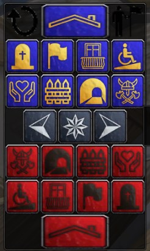
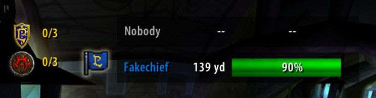
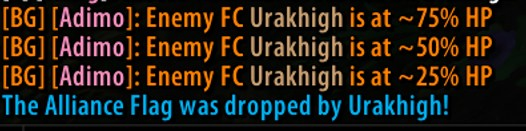
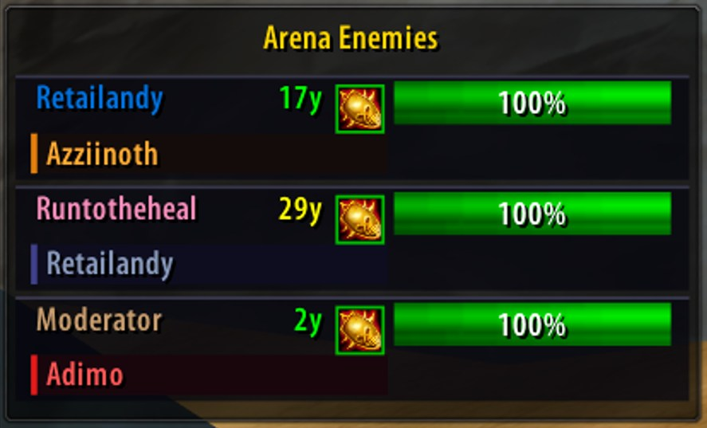

# TurtlePvP

A versatile PvP utility suite explicitly built for **Turtle WoW**. It provides an intelligent HUD, passive enemy tracking, and rapid tactical reporting to enhance your gameplay in battlegrounds and arenas.

> **Author:** Adimo [Tel'abim]  
> **Version:** 3.2  
> **GitHub:** https://github.com/DrOmida/TurtlePvP

---

## The Three Core Functions

TurtlePvP comes with three main systems. All options are fully modular and can be toggled on or off! To access the settings menu, simply type `/tpvp` in chat or click the minimap button.

### 1. EFC Location Reporter
A dedicated grid of 23 location buttons tailored to Warsong Gulch. Click any location button to instantly announce the Enemy Flag Carrier's (EFC) position in Battleground chat (automatically uses Common or Orcish depending on your faction). 

### 2. Warsong Gulch Flag Tracker
A live HUD that tracks who has the flag and their distance from you. It also automatically broadcasts `/bg` callouts when the enemy FC's health drops to 75%, 50%, and 25%. This relies on auto-recovery via passive buffs and prevents spam with intelligent AddonMessage syncing.

### 3. Arena Enemy Tracker HUD
Automatically activates in Turtle WoW's custom arena zones (Blood Arena, Lordaeron Arena, Sunstrider Court, Blood Ring). It displays your enemies' health, their distance, who they are currently targeting, and what spell they are currently casting. 

---

## Menu & Settings
Use the `/tpvp` command to open the TurtlePvP menu. From here, you can toggle every single module on or off independently. You can also right-click any of the HUDs in-game to unlock them, drag them to your preferred position, and right-click them again to lock them in place.

---

## Requirements

To unlock the full power of TurtlePvP, install these optional dependencies:

| Dependency | What it unlocks |
|------------|-----------------|
| **[Nampower](https://twinstar-addons.github.io/addons/nampower/)** | Accurate HP values for enemies out of range or behind objects |
| **[UnitXP](https://github.com/allfoxwy/UnitXP)** | Precise 3D distance between you and carriers / arena enemies |

*The addon works without both, but HP and distance readouts will be limited to whoever you currently have targeted.*

---

## Credits
- **Adimo [Tel'abim]** - Author
- **Cubenicke** - EFC Reporter concept (https://github.com/cubenicke/EFCReport)